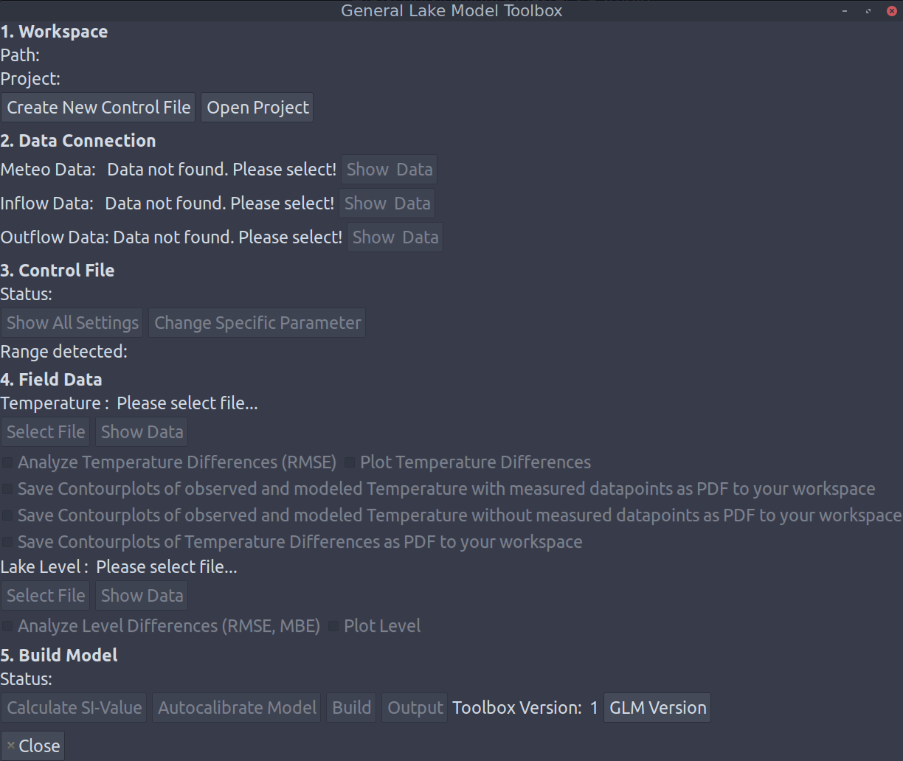

<!-- README.md is generated from README.Rmd. Please edit that file -->

```{r setup, include = FALSE}
knitr::opts_chunk$set(
  collapse = TRUE,
  comment = "#>",
  fig.path = "man/figures/README-",
  out.width = "100%"
)
```
# glmgui

Fork of the `glmgui` package: https://doi.org/10.5281/zenodo.2025865

## Installation

```{r eval=FALSE}
devtools::install_github("jsta/glmgui")
```

## Usage

```{r eval=FALSE}
library(glmgui)

glmGUI()
```



## Packaging

### Bug fixes

 * Fixed issue with `glmGUI` hanging on model build
 
 * Removed multibyte degree symbols causing errors in `devtools::check`

### Changes

 * Replace use of the `gWidgets` package with `gWidgets2`
 
 * Install dependencies during package install rather than in `glmGUI()`
 
 * Add `roxygen2` documentation

### Wishlist

 * Add ability to explore output of previously run models
 
 * Resolve namespace conflicts between `glmtools` and `rLakeAnalyzer`
 
 * Output graphs do not change when selecting different variables

### CRANification

<details>
<summary>devtools::check() output</summary>
```{r echo = FALSE, error=TRUE}
devtools::check()
```
</details>
